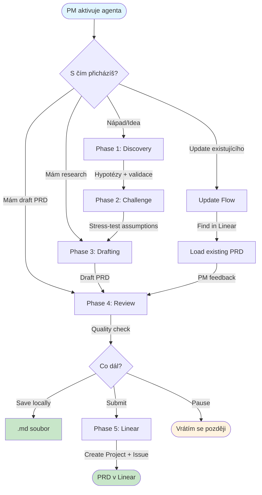

# PRD Workflow Kit

PRD coach pro Keboola Product Managery. Agent "Elis" provází od nápadu přes research až po Linear submission.

## Co to umí

- **Hypothesis-driven přístup** - agent navrhuje hypotézy, PM validuje
- **Challenge patterns** - aktivně zpochybňuje předpoklady (persona mismatch, vague metriky)
- **Flexibilní vstup** - začni kde chceš (nápad, draft, review, update)
- **Linear integration** - automaticky vytvoří Project + Issue s PRD

## Workflow



## Jak začít

Řekni agentovi jedno z:
- "Elis"
- "potřebuju PRD"
- "nový PRD"
- "feature idea"

Agent se zeptá, s čím přicházíš, a navede tě správnou cestou.

## Challenge Patterns

Agent aktivně hledá slabá místa:

| Pattern | Příklad |
|---------|---------|
| **Persona mismatch** | "Říkáš data engineers, ale tohle zní jako business user problém..." |
| **Segment mismatch** | "SLA requirements naznačují Enterprise, ne PAYG..." |
| **Vague metrics** | "'Improve performance' není měřitelné - jaká je baseline?" |
| **Hidden dependencies** | "Tohle předpokládá, že X už funguje. Je to pravda?" |

## Struktura

```
prd-workflow/
├── agents/
│   └── keboola-prd-coach.md    # Agent Elis
└── skills/
    └── prd-linear/
        ├── SKILL.md             # Linear submission logic
        └── references/
            ├── prd-template.md      # PRD šablona
            └── keboola-context.md   # Keboola kontext
```

## Requirements

- Claude Code CLI
- Linear MCP server (pro submission):
  ```bash
  claude mcp add --transport sse linear-server https://mcp.linear.app/sse
  ```

## License

MIT
